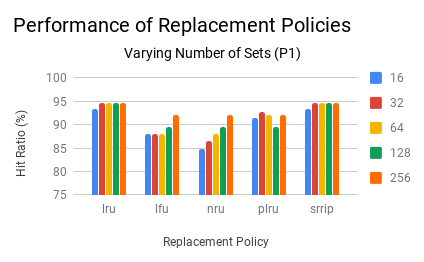
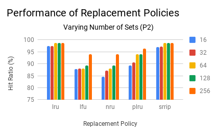

## Analysis of different cache parameters on hit ratio

We have analysed performance of matrix multiplication programs with respect to hit ratio in our one level cache simulator.

For analysis, we considered the following three variants of matrix multiplication:
- P1: DGEMM (Double precision General Matrix Multiply)
- P2: DGEMM with row-major accesses only
- P3: Tiled DGEMM 

We considerd matrices of size 512 X 512 for the above programs.

Analysis on hit-ratio is done on the following:
 - [Impact of Block Size](#impact-of-block-size)
 - [Impact of Number of Sets](#impact-of-number-of-sets)
 - [Impact of Set Associativity](#impact-of-set-associativity)
 - [Impact of Tile Size](#impact-of-tile-size)

### Impact of Block Size

Here we have varied block size of cache over values 8, 16, 32, 64 and 128 bytes. The set associativity and number of sets is kept constant at 4 and 64 respectively. 

Following are the results obtained:

### Impact of Number of Sets

Here we have varied number of sets in cache over values 16, 32, 64, 128 and 256. The block size and set associativity is kept constant at 32 bytes and 4 respectively.

Following are the results obtained:

### Impact of Set Associativity

Here we have varied set associativity in cache over values 2, 4, 8, 16 and 32. The block size and number of sets is kept constant at 32 bytes and 64 respectively.

Following are the results obtained:

### Impact of Tile Size

Here we have varied tile size in P3 over values 4, 8 and 16 (side of tile). The block size, set associativity and number of sets is kept constant at 32 bytes, 16 and 64 respectively.

Following are the results obtained:

#### Relevant links
1. [Link](https://drive.google.com/drive/folders/1JsXtNrd9Myawke7c2M9BEU8nSjW3ATSR) to traces of the programs.
2. [Link](https://docs.google.com/spreadsheets/d/1dfC8pnfuAcPPloEfE03zAsp8cmzvUKPmlbnhgLS_E7s/edit?usp=sharing) to google sheets with our results.